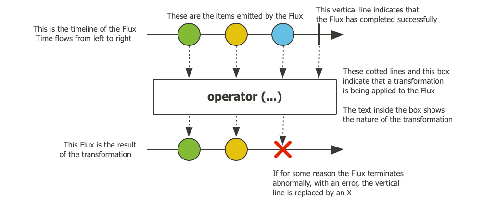

### reactive stream
reactive stream：asynchronous stream processing with non-blocking backpressure.

[官网](https://www.reactive-streams.org/)

[规范](https://github.com/reactive-streams/reactive-streams-jvm)
#### 核心概念
响应式流规范定义了如何处理非阻塞的异步流处理，使用非阻塞的背压机制。
它由四个关键接口组成：Publisher（发布者）、Subscriber（订阅者）、Subscription（订阅）和 Processor（处理器）。

1. **Publisher（发布者）**：
   - 发布者向订阅者发送数据。
   - 它负责管理发送的数据量，基于订阅者处理数据的能力。

2. **Subscriber（订阅者）**：
   - 订阅者从发布者接收数据。
   - 它可以请求发送特定数量的项目（使用 `subscription.request(n)` 方法）或取消订阅。

3. **Subscription（订阅）**：
   - 该接口连接发布者和订阅者。
   - 它允许订阅者通过请求一定数量的项目或取消订阅来控制数据流。

4. **Processor（处理器）**：
   - 处理器是一个同时充当发布者和订阅者的组件。
   - 这使得它能够从发布者接收数据，处理这些数据，然后将处理后的数据发布给一个或多个订阅者。

#### 背压的工作原理
订阅者向发布者发出信号，要求其减慢数据的发送速度（通过 subscription.request(int n) 实现）, 发布者根据实现可能选择不同的策略。
比如，发布者可能会缓冲数据，直到消费者能够处理为止；或者，如果数据超出某个限制，它可能会丢弃多余的数据（尽管这可能导致数据丢失）。

#### 热序列（Hot sequence）和冷序列（Cold sequence）
热序列（Hot sequence）和冷序列（Cold sequence）。
这两个概念主要描述了响应式流（reactive stream）如何对订阅者（subscribers）作出反应。

1. 冷序列（Cold sequence）：

冷序列为每个订阅者从头开始。这意味着，如果数据源是一个HTTP请求，那么每个订阅都会触发一个新的HTTP请求。
冷序列的特点在于，它在订阅时才启动，并且每个订阅者都会经历相同的数据流从头到尾的完整过程。
2. 热序列（Hot sequence）：

热序列不会为每个订阅者从头开始。迟到的订阅者只会接收到他们订阅之后发出的信号。
一些热响应式流可以缓存或部分或全部重放发射的历史。这意味着即使订阅者晚些时候加入，他们也能接收到之前发生的数据。
从一般意义上讲，热序列甚至可以在没有订阅者监听的情况下发射数据，这违反了“在你订阅之前什么都不会发生”的规则。

### 介绍 Java 9 Flow API
https://mrbird.cc/Java-9-Flow-API-Learn.html

https://juejin.cn/post/7104961299670368264

### reactor
https://github.com/reactor/reactor
[边学边练](https://github.com/reactor/lite-rx-api-hands-on)

[官方文档](https://projectreactor.io/docs/core/release/reference/aboutDoc.html)

和 Spring 深度继承，Spring 的 WebFlux 就在它的基础上实现。
1. Flux: 0..N 个项的反应序列；可组合；丰富的 Operator;实现了 Reactive Stream 的 Publisher 接口

2. Mono：表示单值或空（0..1）；可组合；丰富的 Operator;实现了 Reactive Stream 的 Publisher 接口

### RxJava
RxJava (https://github.com/ReactiveX/RxJava)

Overview: RxJava is a library for composing asynchronous and event-based programs using observable sequences for the Java VM.
Key Features:
Extends the observer pattern to support sequences of data/events.
Provides a rich set of operators to compose and transform data flows.
Supports both backpressure (via Flowable) and non-backpressure (via Observable).
Allows for integration with Java 8+ features and is friendly with Android API.
Use Cases: Suitable for a wide range of applications, including Android development and Java-based server applications.

### Reactor vs RxJava
如果是后端的话，更建议学 Reactor。
Target Audience: Reactor is more focused on Spring developers and server-side applications, 
while RxJava is broader and caters to various Java applications, including Android.

Data Types: Reactor uses Mono and Flux, whereas RxJava offers Single, Maybe, Completable, Observable, and Flowable.

Concurrency Model: Both libraries support asynchronous processing, 
but Reactor has a stronger emphasis on integration with project reactor and Spring ecosystem.

### Reactor vs CompletableFuture
1. Reactor：
模型：基于反应式编程，支持异步数据流和背压。
数据类型：使用 Flux（多项）和 Mono（单项）。
错误处理：提供强大的错误处理机制，如 onErrorResume。
功能强大：可组合性和可读性；数据作为流，通过丰富的运算符进行操作；在你订阅之前什么都不会发生；背压（消费者向生产者发出信号，告知其发送频率过高）； 高级但高价值的抽象，与并发无关
适用场景：适合高并发和事件驱动的应用，如微服务。
2. CompletableFuture：
模型：基于传统异步编程，处理单个异步任务。
数据类型：表示未来的单一结果。
错误处理：提供基本的错误处理，如 exceptionally。
适用场景：适合简单的异步任务，易于使用。

https://projectreactor.io/docs/core/release/reference/reactiveProgramming.html#asynchronicity-to-the-rescue

### Spring WebFlux
The original web framework included in the Spring Framework, Spring Web MVC,
was purpose-built for the Servlet API and Servlet containers.
The reactive-stack web framework, Spring WebFlux, was added later in version 5.0. 
It is fully non-blocking, supports Reactive Streams back pressure, and runs on such servers as Netty, Undertow, and Servlet containers.

Both web frameworks mirror the names of their source modules (spring-webmvc and spring-webflux) 
and co-exist side by side in the Spring Framework. 
Each module is optional. Applications can use one or the other module or, 
in some cases, both — for example, Spring MVC controllers with the reactive WebClient.

https://docs.spring.io/spring-framework/reference/web/webflux.html
https://www.baeldung.com/spring-5-webclient
https://docs.spring.io/spring-framework/reference/web/webflux-webclient.html
#### Spring MVC vs Spring WebFlux

If you have a large team, keep in mind the steep learning curve in the shift to non-blocking, functional, and declarative programming. A practical way to start without a full switch is to use the reactive WebClient. Beyond that, start small and measure the benefits. We expect that, for a wide range of applications, the shift is unnecessary. If you are unsure what benefits to look for, start by learning about how non-blocking I/O works (for example, concurrency on single-threaded Node.js) and its effects.
The key expected benefit of reactive and non-blocking is the ability to scale with a small, fixed number of threads and less memory

In Spring MVC (and servlet applications in general), it is assumed that applications can block the current thread, (for example, for remote calls). For this reason, servlet containers use a large thread pool to absorb potential blocking during request handling.

In Spring WebFlux (and non-blocking servers in general), it is assumed that applications do not block. Therefore, non-blocking servers use a small, fixed-size thread pool (event loop workers) to handle requests.

### 常见问题
1.如果之前的项目里面用过 webClient.xx.block() 可能需要更改。
java.lang.IllegalStateException: block()/blockFirst()/blockLast() are blocking, which is not supported in thread reactor-http-nio-2
at reactor.core.publisher.BlockingSingleSubscriber.blockingGet(BlockingSingleSubscriber.java:87) ~[reactor-core-3.6.9.jar:3.6.9]
at reactor.core.publisher.Mono.block(Mono.java:1779) ~[reactor-core-3.6.9.jar:3.6.9]
